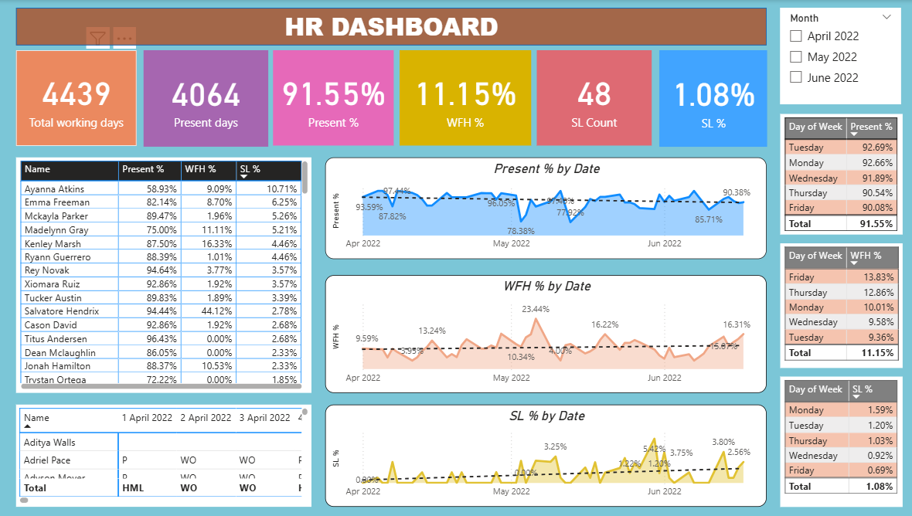

# 📊 Key Insights from the HR Dashboard
# 🧾 HR Dashboard (Power BI Project)

## 📘 Project Overview
This Power BI dashboard provides insights into employee attendance, work-from-home trends, and sick leave patterns from April to June 2022.  
The goal is to help HR teams monitor workforce behavior and identify attendance trends.

## 🛠️ Tools Used
- Power BI  
- Microsoft Excel (data source)  
- DAX for calculated measures  

## 📊 Key Insights from the HR Dashboard
- **Total Working Days:** 4,439  
- **Total Present Days:** 4,064  
- **Average Attendance:** 91.55%  
- **WFH %:** 11.15%  
- **Sick Leave %:** 1.08%  
- Attendance peaked at **96% in April**, dipped to **78% in May**, and recovered to **~90% in June**.  
- **Fridays** have the **highest WFH (13.83%)** and **lowest Present % (90.08%)**, showing a clear end-of-week remote trend.  
- **Monday** shows slightly higher sick leave usage (1.59%), suggesting extended weekends.  

## 📅 Time Period
April 2022 – June 2022

## 📈 Dashboard Preview

## 💡 Conclusion
The HR Dashboard demonstrates that overall employee attendance is strong with balanced remote work practices.  
Minor dips on Fridays and slight increases in Monday absences may help HR plan engagement or schedule flexibility programs.

